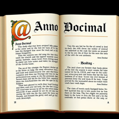

Anno-Docimal
============

[](https://github.com/blackbuild/anno-docimal)

**NOTE**: This is a work in progress. I started doing rc-releases because I need that functionality. However, while I think the core concept is sound, the implementation is still in flux. This is especially true for the naming and API of helper classes. Refactorings should be easy enough, but will not necessarily be separately documented, so a look at the actual code changes might be necessary. This will of course change once the API has reached a more stable state.

Anno-Docimal was mainly developed for supporting the [KlumDSL-Suite](https://github.com/klum-dsl), thus its improvements are driven by the needs of KlumAST and KlumDSL.

# Overview

Anno-Docimal is a tool for generating javadoc for (mainly) generated code, usually created by groovy AST transformations.

Since ast transformations cannot create additional files, it uses a turnaround way:

1. the AST transformation generates a class with the special annotation `@AnnoDoc`, which contains the actual javadoc as a string
2. The Anno-Docimal tool uses the generated class file to create a stub file with the regular javadoc.
3. The regular javadoc is then generated by the regular javadoc tool.

Anno-Docimal consists of the following modules:

1. `anno-docimal-annotation` contains the `@AnnoDoc` annotation. Since we use retention `RUNTIME`, it must be present at runtime.
2. `anno-docimal-ast` contains a groovy AST transformation that converts existing javadoc comments into `@AnnoDoc` annotations. It also contains helper code to simplify conversion and creation of JavaDoc annotations. This is necessary if the actual generator creates additional methods or inner classes. It only needs to be present at compile time, usually as a dependency of the generating library.
3. `anno-docimal-global-ast` only consist of a global AST transformation descriptor pointing to `InlineJavadocsTransformation` and anno-docimal-ast as transitive dependency. It is meant to be included in the build process (compile-only).
4. `anno-docimal-apt` contains an annotation processor that can be used to extract the javadoc from java source files. Since annotation processors cannot modify existing classes, it stores the javaodcs in a separate properties file, which is included in the jar file. These properties will also be consulted when trying to read or use the javadoc of a class or method object.
5. `anno-docimal-generator` contains the main tool that reads the `@AnnoDoc` annotations and creates the stub files. It is meant to be included in the build process (and will eventually be packed as a gradle and/or maven plugin).

# Usage

The standard usages assumes that the transformation library employing AnnoDocimal is split into a compileTime and a runtime part (and usually a separate annotation module as dependency to runtime and compileTime modules). The compileTime
part contains some AST transformations(s) that enhance further code. The runtime part contains code used by those transformations. The runtime part 
is optional (KlumAST 1 was compileTime only), the important part is that the AST transformation is *only* present during compile time.

## Include the `anno-docmial-global-ast` module as api dependency

In Maven this would be a regular compile dependency, in older Gradle version, whis was `compile`.

`my-transformation-compile: build.gradle`:
```gradle
dependencies {
    implementation 'com.blackbuild.annodocimal:anno-docimal-global-ast:0.1.0'
}
```

This will activate the `InlineJavadocsTransformation` on all classes of the source set being compiled with `my-tranformation`, converting all existing javadoc comments into `@AnnoDoc` annotations.

This takes care of all classes and members *not* created or modified by your transformation.

## Add the `anno-docimal-annotation` module as an api dependency to your annotation module

So that code having a dependency on your annotation modules also has access to the `@AnnoDoc` annotation.

`my-transformation-annotation: build.gradle`:
```gradle

dependencies {
    implementation 'com.blackbuild.annodocimal:anno-docimal-annotation:0.1.0'
}
```

## Let your transformation add `@AnnoDoc` annotations to generated code

Code in your transformation library should use the methods provided by `AnnoDocUtil` to add the `@AnnoDoc` annotation to the generated code.

`my-transformation-ast: MyTransformation.groovy`:
```groovy
import org.codehaus.groovy.ast.*
import org.codehaus.groovy.control.SourceUnit
import org.codehaus.groovy.transform.AbstractASTTransformation
import static org.codehaus.groovy.ast.tools.GeneralUtils.*

class DummyTransformation extends AbstractASTTransformation {
    @Override
    void visit(ASTNode[] nodes, SourceUnit source) {
        init(nodes, source)
        ClassNode classNode = (ClassNode) nodes[1]

        def method = classNode.addMethod(
                "printHelloWorld",
                ACC_PUBLIC,
                ClassHelper.VOID_TYPE,
                Parameter.EMPTY_ARRAY,
                ClassNode.EMPTY_ARRAY,
                GeneralUtils.stmt { GeneralUtils.callThisX("println", GeneralUtils.constX("Hello World")) }
        )
        AnnoDocUtil.addDocumentation(method, "Says hello world")
    }
}
```

This creates a new method node and adds the `@AnnoDoc` annotation to it. This
should be done for all generated public elements.

## Have the consumers of your transformation use the gradle plugin

If your transformation come with a gradle plugin itself, it would be easiest to
include the `anno-docimal-gradle-plugin` module as a dependency to your plugin
and apply it in that plugin's apply method.

Otherwise, state in your documentation that the plugin must be applied:

`consumer: build.gradle`:
```gradle
plugins {
    id 'com.blackbuild.annodocimal' version '<version>'
}
```

The consuming library must also add your runtime module as a runtime (api or implementation) and your transformation module as a compileOnly dependency (this is independent off AnnoDocimal).

`consumer: build.gradle:
```gradle

dependencies {
    compileOnly 'my-project:my-transformation-ast'
    implementation 'my-project:my-transformation-runtime'
}
```

## Java Source code an proxy methods

If an ast transformation needs access to the javadoc of a class written in Java instead of Groovy, it is necessary to provide
the javadoc of the java class in a different way. There are currently two options.

Either the javadoc is duplicated into an AnnoDoc annotation, or the `anno-docimal-apt` module is used to extract the javadoc to
property files which can be used by the ast transformation.

On scenario, where this might be useful is where a Groovy AST transformation is used to generate proxy methods to methods of
an existing java class, while retaining the original javadoc (perhaps transformed).

## Templating

AnnoDocimal supports templating for javadocs. This is especially useful when generating code with a lot of similar methods. The generated 
documentation using a doc builder replaces placeholders with the actual values. Replacements are controlled by a map of
template values as well as the list of parameters (in case of methods).

Template values are added via explicit DocBuilder.template, templates or templatesFrom methods. The can also be added using 
the special `@template` javadoc tag.

Currently, we have three different replacements:

### Simple value replacements

Simple values come in the form of `{{key}}` or `{{key:default}}` and are replaced by the value of the key in the template values map.
If the key is not present in the map, the default value or the key itself is used.

### Conditional parameter replacements

Conditional parameter replacements are used to replace a placeholder with a value depending on the presence of a parameter. 
They come in the form of `{{param:key?if}}` or `{{param:key?if:else}}`. If the parameter is present, the if value is used, otherwise the else value or
an empty string if no else value is present.

### Conditional template replacements

Basically the same as conditional parameter replacements, but the condition is based on the presence of a template value (which itself is ignored).
They come in the form of `{{key?if}}` or `{{key?if:else}}`.

## Source Extractors

If the transformation using anno-docimal enhances existing code, i.e. adds methods or, as in the case of "klum-ast", the result is a mix of source based and annotation based javadoc comments. To generate the final documentation, two approaches are possible:

- a custom doclet that is able to parse annotation based javadoc comments as well as source based comments
- a tool that extracts the source based comments and creates a stub file with the original comments as well as annotation based comments by AST transformations. This is the approach taken by anno-docimal.

The advantage of the second approach is that it is easier to implement and can be used with the standard javadoc tool, which allows custom doclets (like asciiDoc or Markdown) to be used.

With Groovy 2.4 (which is supported in the first version of anno-docimal for Jenkins Pipeline support), there is no easy option to access the javadoc in a source file during an AST transformation, so the GroovyDoc Tool is used. With later Groovy versions, this is a lot easier.

# FAQ

## Why the Groovy 2.4 support?

The main use case for AnnoDocimal is as documentation tool for my [KlumAST DSL Generator](https://github.com/klum-dsl/klum-ast). KlumAST was developed to be used as part of a Jenkins Pipeline library and Jenkins Pipelines still use (way
outdated) Groovy 2.4 (see (https://issues.jenkins.io/browse/JENKINS-53372) for details). Since I plan to sunset the Groovy 2 support after the next release, I can drop the Groovy 2.4 support here as well.

## Why JavaDoc and not GroovyDoc?

My main goal is good IDE support without the need for special plugins. Once again, the main use case is KlumAST, which is designed to be use from normal Java code. Since I don't need any GroovyDoc features, GroovyDoc has not been widely adopted anyway, JavaDoc seems a better common ground.


Roadmap:

- [x] Implement ast transformation
- [x] support for inner classes
- [ ] support for diverse javadoc formats (like asciidoc or markdown)
- [ ] helper methods to simplify the creation of `@AnnoDoc` annotations
- [x] simple templating for javadocs (for klum)